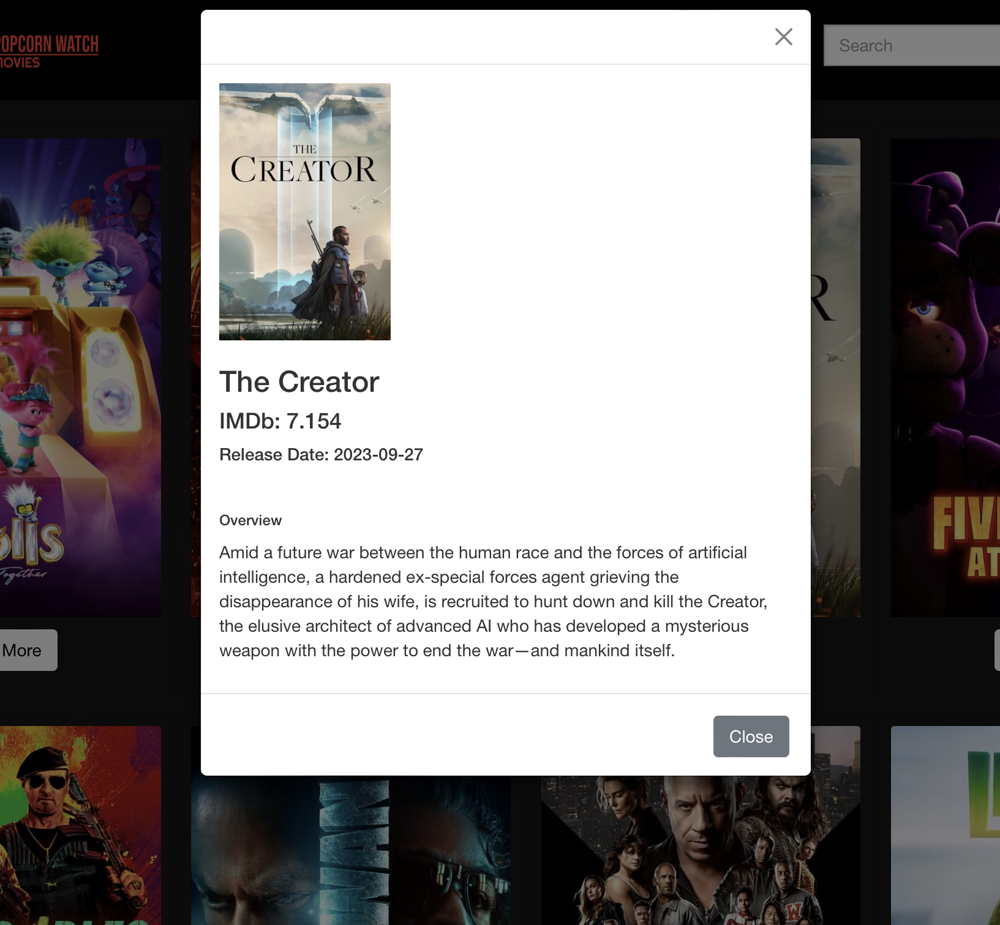
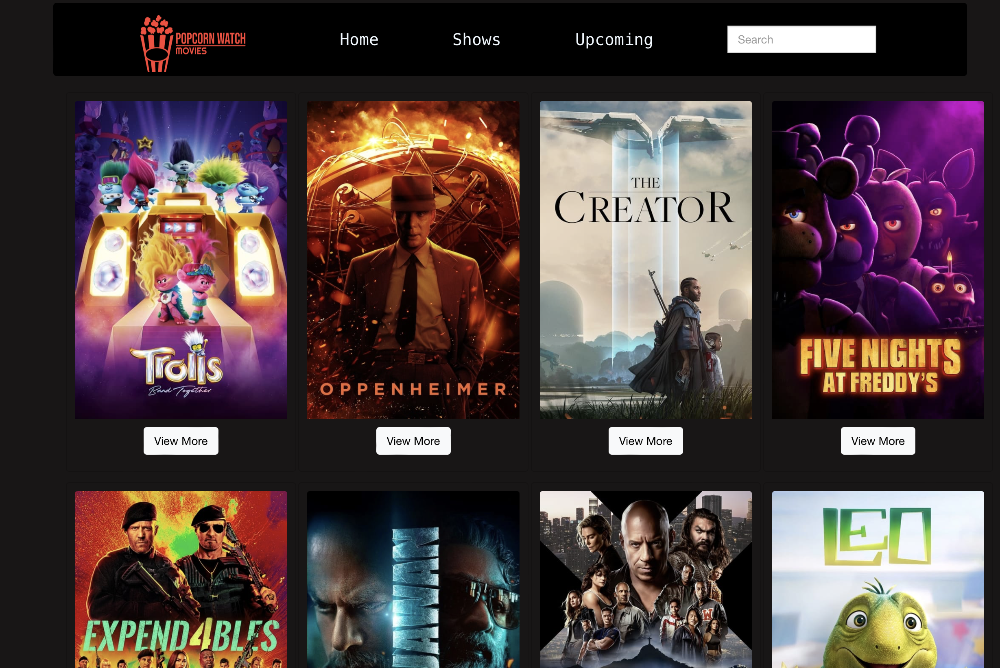

# Project #3:Popcorn Watch

## High-level Project Overview

- The users for this project would be individuals who enjoy watching tvs and movies. This website allows for them to easily check the ratings and descriptions of new movies or shows that are upcoming.
- This website was inspired by netflix. The most important feature is the ability for users to use a search bar to look for specific shows or movies.

## Situation

- This application aims to provide a convenient platform for users to stay updated with upcoming releases by offering ratings and descriptions. The primary motivation behind developing this application was to enhance the user experience by incorporating a search bar feature, allowing users to easily find specific shows or movies they are interested in.

## Task

- The main part of this project is in the `src` folder which contains our components and back end routes. We decided to structure our project this way since it was a majority front end focused project. The design process involved creating wireframes and mockups to visualize the user interface and functionality of the website.

## Wire Frame

### Action

- To achieve the desired result, we implemented a search bar component that allows users to input specific keywords. We then utilized backend routes to handle the search functionality and retrieve relevant shows or movies based on the user's input.
- The code involved handling user input, making API calls to fetch data, and rendering the results on the frontend. Additionally, we implemented filtering and sorting options to enhance the search experience for users.

### Result

- Picture of Pop up card

- Search Bar preview 

- Website preview 

## Technologies

- Movie API
- React.js
- CSS
- HTML
- AWS

## Competencies

### JF 2.5

Can implement a responsive User Interface

- I helped create a user interface that allows users to browse through upcoming tv shows and movies. The user can click a button the gives more details on the selected movie, then the website will respond with a pop up of more details.
- This allowed me to get a better understanding of responsive design. I also learned the importance of making user friendly responsive applications.

### JF 6.6

Shows initiative for solving problems within their own remit, being resourceful when faced with a problem to solve

- During this project we unexpectedly ended up being short of a team member. Me and my remaining team member had to become resourceful and figure out how we were going to divide up the work to get everything done in time.
- This taught me how to create and effective plan and adjust when unexpected things occur. This project helped me feel more confident being able to tackle complex issues, and pushed me to grow as a software engineer.
